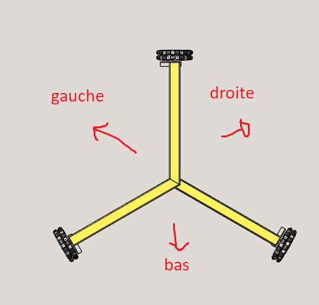

# Utilisation :

## Installation :

TODO : requirements.txt
Nécessite eCAL, protobuf, matplotlib, flask

## Usage

Lancer `simu_robot.py` . Paramètre par défaut : navigation différentielle.
Pour visualiser le robot sur matplotlib en temps réel, lancer `basic_plot.py`
Pour contrôler en vitesse, lancer `basic_teleop.py` et aller sur http://127.0.0.1:5000/
## Drivetrain (base roulante)

Pour la base roulante, les messages de commandes de vitesse correspondent pour le mode de navigation différentielle à vx, vy, vtheta.
Pour les robots holonomes 3 roues, vx = roue 1, vy = roue 2, vtheta = roue 3.

La roue 1 est celle avant, angle 0°, en haut. 
La roue 2 est celle à gauche, 120° par rapport à la roue 1.
La roue 3 est celle à droite, 120° par rapport à la roue 2. 
Secteur gauche : Entre roue 1 et roue 2
Secteur droit : entre roue 1 et 3
Secteur bas : entre roue 2 et 3.

Pour simplifier la programmation, la simulation n'avance que dans les directions où les roues pointent vers "l'extérieur" du robot (comme sur le schéma).

Il pourrait être plus pertinent pour le vrai robot de faire avancer dans la direction inverse, pour que le robot fasse "chasse neige" d'obstacle au cas où.

# Compilation protobuf

protoc --python_out=./ messages.proto